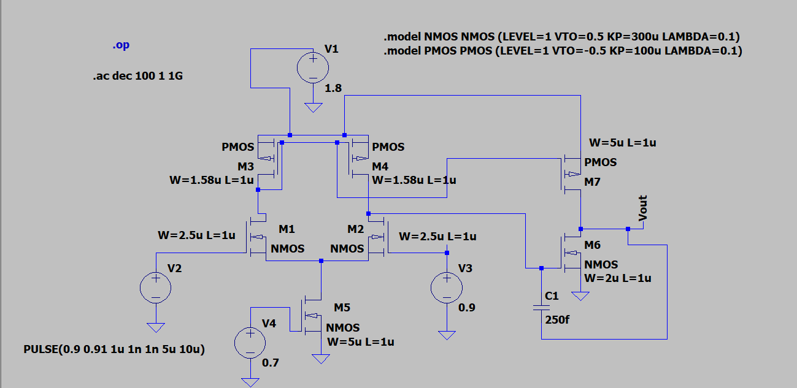
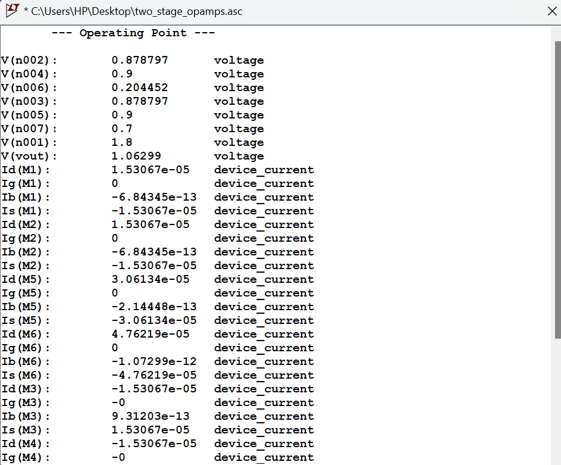
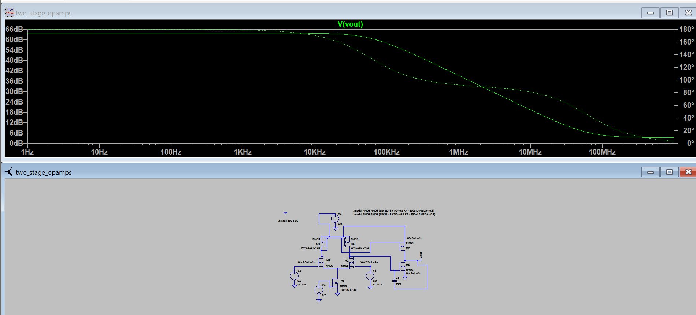
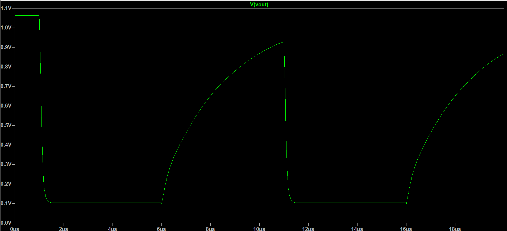

# Two Stage CMOS Operational Amplifier Design using LTspice

## Project Overview

This project implements a **Two Stage CMOS Operational Amplifier** using transistor level design in LTspice.

The goal of this project is to design a low power CMOS op-amp from basic MOSFET building blocks and analyze important analog parameters such as:

- DC Gain
- Unity Gain Bandwidth
- Phase Margin
- Common Mode Rejection Ratio (CMRR)
- Slew Rate
- Output Swing
- Power Consumption

The op-amp is designed completely using MOSFET devices without using any predefined amplifier blocks.

---

# Circuit Diagram

*Complete transistor level schematic of the designed two stage CMOS operational amplifier.*

---

# Circuit Architecture

The designed operational amplifier consists of two gain stages followed by Miller frequency compensation.

## 1. Differential Input Stage

The first stage consists of an **NMOS differential pair** formed using transistors **M1 and M2**.

The differential pair converts the input differential voltage:

*Vin+ - Vin-*

into a differential current signal.

The transistor **M5** acts as the tail current source and provides constant bias current to the differential pair.

## 2. PMOS Current Mirror Active Load

Transistors **M3 and M4** form the PMOS current mirror active load.

The PMOS current mirror:

- Provides high output resistance
- Improves voltage gain
- Converts differential output into single ended output

The first stage output is obtained from the drain node of M2-M4.

## 3. Common Source Second Stage

The second amplification stage is implemented using a common source amplifier.

It consists of:

- **M6:** NMOS common source transistor
- **M7:** PMOS active load

This stage provides additional voltage amplification and improves the overall gain.

## 4. Miller Compensation

A Miller compensation capacitor is connected between the first stage output and final output node.

*Cc = 250 fF*

The compensation capacitor:

- Creates a dominant pole
- Improves phase margin
- Provides frequency stability

---

# MOSFET Models Used

## NMOS

*.model NMOS NMOS (LEVEL=1 VTO=0.5 KP=300u LAMBDA=0.1)*

## PMOS

*.model PMOS PMOS (LEVEL=1 VTO=-0.5 KP=100u LAMBDA=0.1)*

---

# Final Transistor Sizing

| Transistor | Function | Size |
|---|---|---|
| M1 | Differential Pair NMOS | W=2.5u , L=1u |
| M2 | Differential Pair NMOS | W=2.5u , L=1u |
| M3 | PMOS Current Mirror | W=1.58u , L=1u |
| M4 | PMOS Current Mirror | W=1.58u , L=1u |
| M5 | Tail Current Source | W=5u , L=1u |
| M6 | Second Stage NMOS | W=2u , L=1u |
| M7 | Second Stage PMOS | W=5u , L=1u |

Compensation capacitor:

*Cc = 250 fF*

---

# DC Operating Point Analysis

DC analysis was performed to verify:

- Correct MOSFET biasing
- Drain currents
- Output operating voltage

LTspice command used:

*.op*

## DC Simulation Results

| Parameter | Value |
|---|---|
| Supply Voltage | 1.8 V |
| Output Bias Voltage | ~1.06 V |
| Tail Current | ~30.6 uA |
| Input Branch Current | ~15.3 uA |
| Supply Current | ~78 uA |

Power Consumption:

*Power = VDD × IDD*

*Power = 1.8 × 78uA*

**Power ≈ 140 uW**

---

# AC Frequency Response Analysis

AC analysis was performed to measure:

- Open loop voltage gain
- Unity gain bandwidth
- Phase margin

Simulation command:

*.ac dec 100 1 1G*

Differential input excitation:

Positive input:

*DC = 0.9V*

*AC = +0.5V*

Negative input:

*DC = 0.9V*

*AC = -0.5V*

Therefore the total differential AC input:

*Vid = 1V*

## AC Results

| Parameter | Value |
|---|---|
| DC Gain | ~65 dB |
| Unity Gain Bandwidth | ~40-50 MHz |
| Phase Margin | ~80° |

---

# Common Mode Gain and CMRR Measurement

For common mode analysis, both inputs were given the same AC signal.

Input condition:

*Vin+ AC = 1*

*Vin- AC = 1*

Measured common mode gain:

*Acm ≈ 1 dB*

CMRR calculation:

*CMRR(dB) = Ad(dB) - Acm(dB)*

*CMRR = 65 - 1*

**CMRR ≈ 64 dB**

---

# Transient Analysis

Transient simulation was performed to measure large signal behavior and slew rate.

Input pulse applied:

*PULSE(0.9 0 1u 1n 1n 5u 10u)*

## Transient Results

| Parameter | Value |
|---|---|
| Positive Slew Rate | ~0.2 V/us |
| Negative Slew Rate | ~4 V/us |
| Output Swing | 0.1V - 1.06V |

---

# Final Designed Op-Amp Specifications

| Specification | Value |
|---|---|
| Technology | CMOS LEVEL-1 |
| Supply Voltage | 1.8V |
| Gain | ~65dB |
| Unity Gain Bandwidth | 40-50MHz |
| Phase Margin | ~80° |
| CMRR | ~64dB |
| Power Consumption | ~140uW |
| Compensation Capacitor | 250fF |

---

# Comparison With LM741 Operational Amplifier

| Parameter | Designed CMOS OpAmp | LM741 |
|---|---|---|
| Technology | CMOS | Bipolar |
| Supply Voltage | 1.8V | ±15V |
| Gain | ~65dB | ~100dB |
| Bandwidth | 40-50MHz | ~1MHz |
| Slew Rate | 0.2-4V/us | 0.5V/us |
| Power Consumption | ~140uW | ~50mW |
| Input Stage | MOS Differential Pair | BJT Differential Pair |
| Compensation | Miller Compensation | Internal Compensation |

---

# Conclusion

A complete transistor level **Two Stage CMOS Operational Amplifier** was successfully designed and simulated in LTspice.

The design demonstrates important analog IC design concepts:

- Differential pair amplification
- Current mirror active loading
- Common source voltage gain stage
- Miller compensation
- Frequency response analysis

The final amplifier achieved high bandwidth, good phase margin and low power operation.
